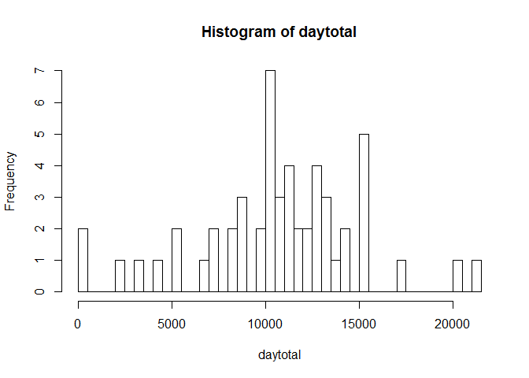
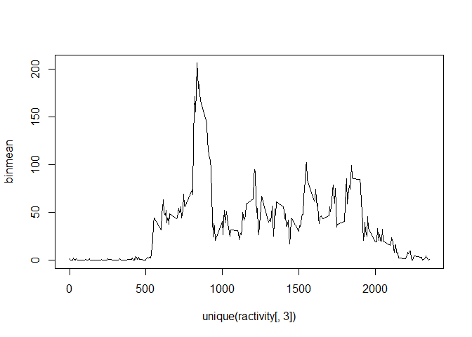
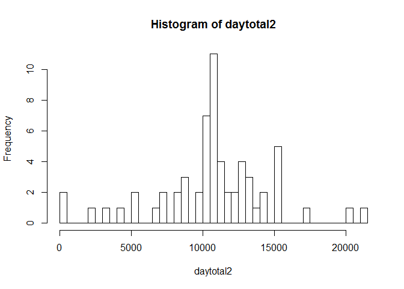
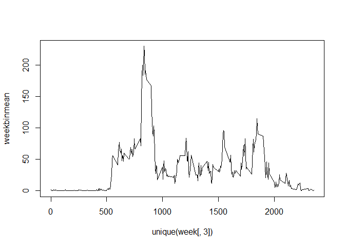
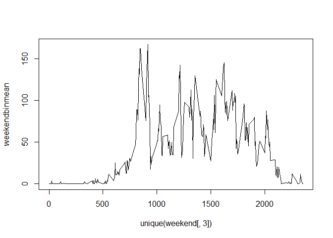

# Reproducible Research: Peer Assessment 1


## Loading and preprocessing the data

```r
activity<-read.csv("activity.csv")
ractivity<-activity[complete.cases(activity),]
```

## What is mean total number of steps taken per day?

```r
daytotal<-tapply(ractivity[,1],ractivity[,2],sum, na.rm=TRUE)
hist(daytotal,breaks=(length(daytotal)))
```

 

```r
print(mean(daytotal,na.rm=TRUE))
```

```
## [1] 10766.19
```

```r
print(median(daytotal,na.rm=TRUE))
```

```
## [1] 10765
```

## What is the average daily activity pattern?

```r
binmean<-tapply(ractivity[,1],ractivity[,3],mean,na.rm=TRUE)
plot(unique(ractivity[,3]),binmean, type="l")
```

 

```r
#Calculate the 5 minute bin with the highest activity
for(i in 1:length(binmean)){
  if(binmean[i] == max(binmean)){
    print(i)
  }
}
```

```
## [1] 104
```

## Imputing missing values

```r
print(sum(!complete.cases(activity)))
```

```
## [1] 2304
```

```r
cac<-activity

lbinmean<-data.frame()
lbinmean<-cbind(binmean)
for(i in 1:(length(cac[,1]))){
  if(is.na(cac[i,1])){
    if((i%%288)>0){
    cac[i,1]<-lbinmean[(i%%288)]
    }
    else{
      cac[i,1]<-lbinmean[(i/288)]
    }
  }
}
daytotal2<-tapply(cac[,1],cac[,2],sum, na.rm=TRUE)
hist(daytotal2,breaks=(length(daytotal2)))
```

 

```r
print(mean(daytotal2,na.rm=FALSE))
```

```
## [1] 10766.13
```

```r
print(median(daytotal2,na.rm=FALSE))
```

```
## [1] 10765.34
```

## Are there differences in activity patterns between weekdays and weekends?

```r
Dayname<-weekdays(as.Date(cac[,2]))
for(i in 1:(length(Dayname))){
  if(is.na(cac[i,1])){
    if((i%%288)>0){
    cac[i,1]<-lbinmean[(i%%288)]
    }
    else{
      cac[i,1]<-lbinmean[(i/288)]
    }
  }
}

Dayname<-data.frame()
Dayname<-cbind(weekdays(as.Date(cac[,2])))
cac<-cbind(cac,(rep(1,length(cac[,1]))))
weekend<-data.frame()
week<-data.frame()
for(i in 1:(length(Dayname[,1]))){
  if(Dayname[i,1]=="zondag" | Dayname[i,1]=="zaterdag"){
      cac[i,4]<-0
      weekend<-rbind(weekend,cac[i,])
  }
  else{
    week<-rbind(week,cac[i,])
  }
   
}

weekbinmean<-tapply(week[,1],week[,3],mean,na.rm=TRUE)
weekendbinmean<-tapply(weekend[,1],weekend[,3],mean,na.rm=TRUE)
par=(mfrow=c(2,1))
plot(unique(week[,3]),weekbinmean, type="l")
```

 

```r
plot(unique(weekend[,3]),weekendbinmean, type="l")
```

 
